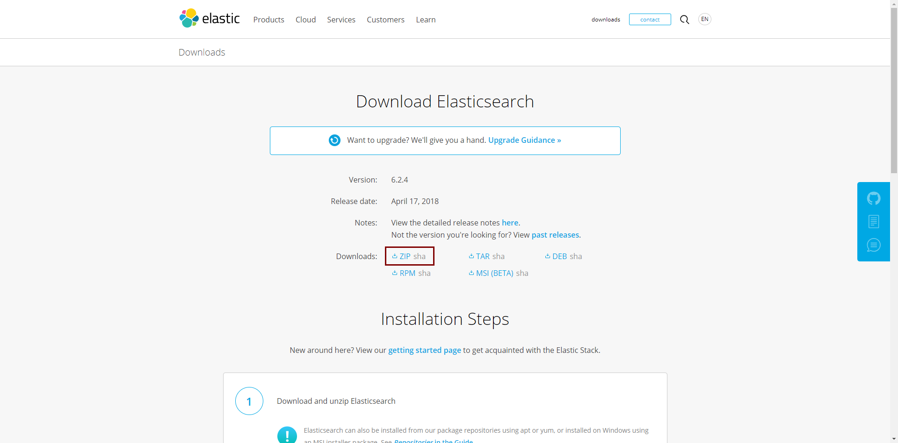
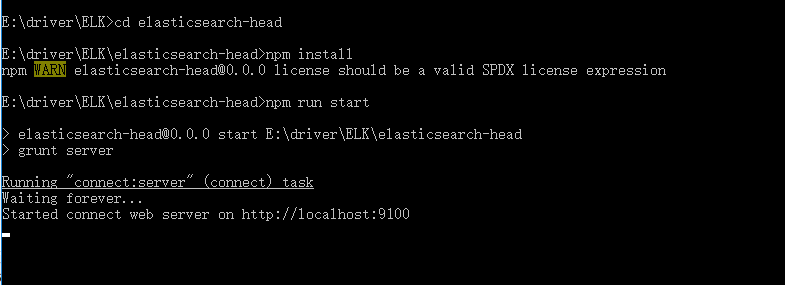

### 下载安装ElasticSearch

#### 在elastic官网中下载ElasticSearch

 - 地址：https://www.elastic.co/downloads/elasticsearch
 
 - windows安装选择ZIP进行下载
 
 
 - 解压到ELK目录下
 
#### cmd进入ElasticSearch解压后的bin目录执行elasticsearch-service.bat install
````
E:\driver\ELK\elasticsearch-6.2.4\bin>elasticsearch-service.bat install

````
- 提示：The service 'elasticsearch-service-x64' has been installed.表示安装成功

- install:安装服务(仅安装一次)|remove:删除服务|start:启动|stop:暂停|manager：打开服务管理器
- elasticsearch-service.bat install|remove|start|stop|manager

#### 浏览器打开localhost:9200

 - 
 
 #### 下载安装head插件
 
 - 环境需要nodejs npm grunt并下载elasticsearch-head
 - 进入elasticsearch-head 加载依赖并启动
 
 
 - 修改elasticsearch配置（config/elasticsearch.yml）添加如下配置
 ````
http.cors.enabled: true
http.cors.allow-origin: "*"
 
 ````
 - 重启elasticsearch 
  ````
elasticsearch-service.bat stop
elasticsearch-service.bat start
  
  ````

