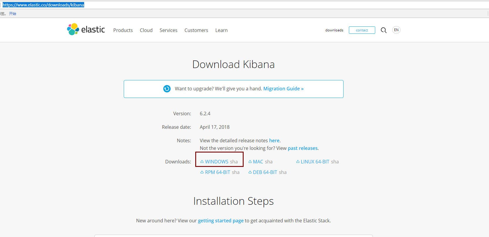

### 下载安装Kibana
#### 在elastic官网中下载Kibana

 - 地址：https://www.elastic.co/downloads/kibana
 
 - windows安装选择WINDOWS进行下载
 
 
 - 解压到ELK目录下
 
 #### 进入config目录修改配置文件kibana.yml
  ````
  #打开elasticsearch.url 并指向已安装好的elasticsearch 地址
 elasticsearch.url: "http://localhost:9200"
  ````
  
 #### cmd进入bin目录执行kibana.bat
  
  
 #### 浏览器打开localhost:5601
 
   