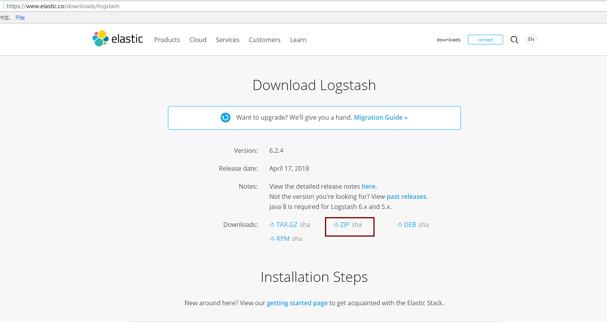
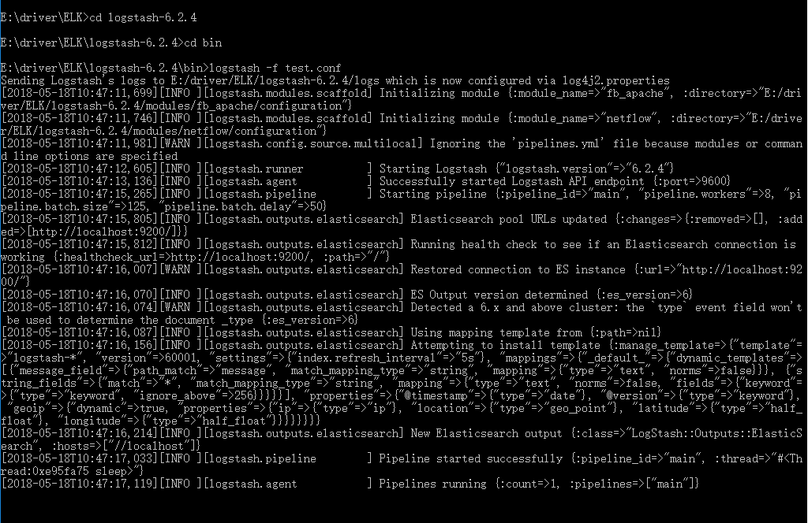
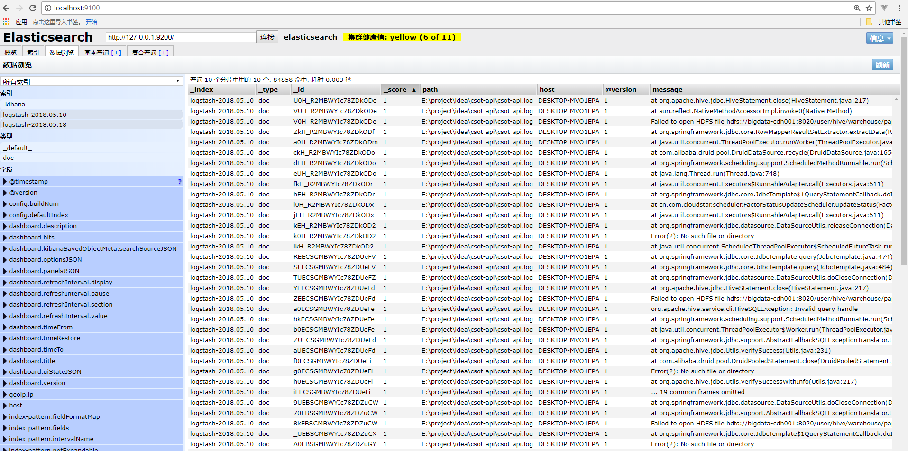

### 下载安装Logstash
#### 在elastic官网中下载Logstash

 - 地址：https://www.elastic.co/downloads/logstash
 
 - windows安装选择ZIP进行下载
 
 
 - 解压到ELK目录下
 #### 进入bin目录 创建test.conf配置文件，内容如下
 ````
 #指定输入（数据来源：我这边使用的本地一个跑起来的项目日志）输出（elasticsearch）
input {
    file {
        path => "E:\project\idea\csot-api\csot-api.log"
        start_position => "beginning"
    }
}

output {
    elasticsearch {
        hosts => "localhost"
    }
}
 
 ````
 #### cmd进入bin目录，适用logstash -f test.conf
  
  
 #### 浏览器打开elasticsearch-head 在数据浏览中可见logstash纳入的相关日志
 
   
   
   
 